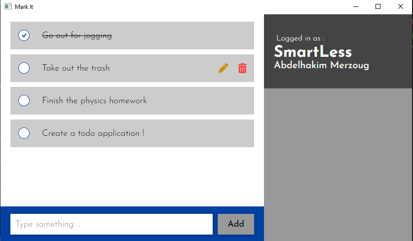

# MarkIt
MarkIt is a quick solution to save your ideas and retrieve them.

## Technologies
This project is solely built on dotnet frameworks
* WPF for Desktop
* ASP.NET Core for the API (backend)
## Download link
You can download the latest [release](https://github.com/sudo-bluee/MarkIt/releases/latest) or clone the repository and [Install](#installation-for-developers) the backend locally
## Installation for developers
1. Configure Desktop Application [App.xaml.cs](MarkItDesktop/App.xaml.cs) services to use your hosted version by changing base address 
  ```c# 
    client.BaseAddress = new Uri("https://localhost:5000/api/auth/");
  ```
2. Install the dev certificat to enable **HTTPS** `dotnet dev-certs https`
3. Start the WebAPI using the dotnet CLI `dotnet run MarkItWebAPI`
4. Build the application `dotnet build MarkItDesktop` and run it.
